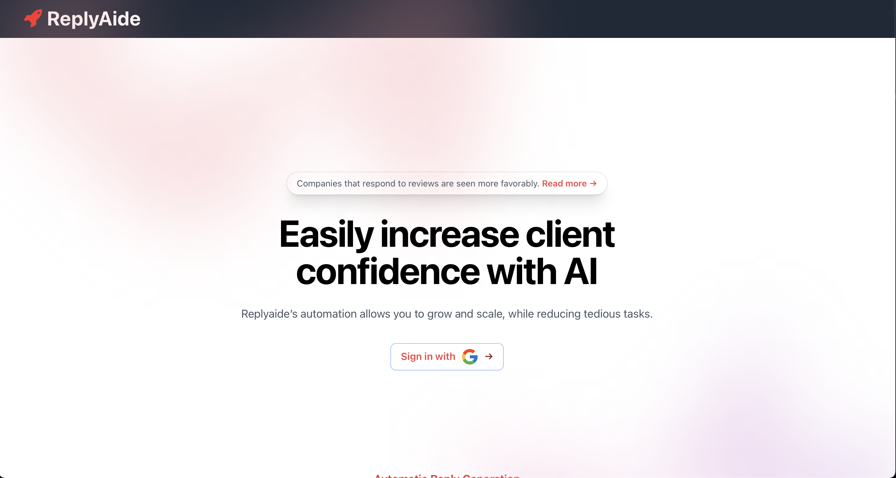

# replyaide.com

### Welcome to the Replyaide - automatic customer reply generator. This software is designed to help businesses quickly and efficiently respond to customer inquiries.

#### The website is hosted via Netlify and Heroku on replyaide.com

## Getting Started with the Frontend

1. Clone the repository to your local machine using the following command:

git clone https://github.com/manav-s/replyaide-dot-com.git

2. Navigate to the cloned repository using the following command:

cd replyaide-dot-com

3. Install the necessary dependencies using the following command:

npm install

4. Start the React app using the following command:

npm start

5. The app will now be running on [http://localhost:3000](http://localhost:3000) in the browser. You will also need to provide your own firebase.js file with your own configuration.

## Using the Software

1. Once the app is running, you will be prompted to enter customer inquiries.
2. The software will analyze the inquiry and generate a response.
3. You can review and edit the response before sending it to the customer.

## Note
- This software is intended as a starting point for customer replies and may not always generate appropriate responses. Use at your own discretion and make sure to review and edit the generated responses before sending.

- The software is currently in the development stage, so it may have bugs and limitations.

Please contact our support team if you have any questions or issues.

## Getting Started with the Backend

1. Navigate to the api folder in your favorite IDE
2. Start ReplyaideApiApplication

## You may have to adjust your port settings to connect both together.

